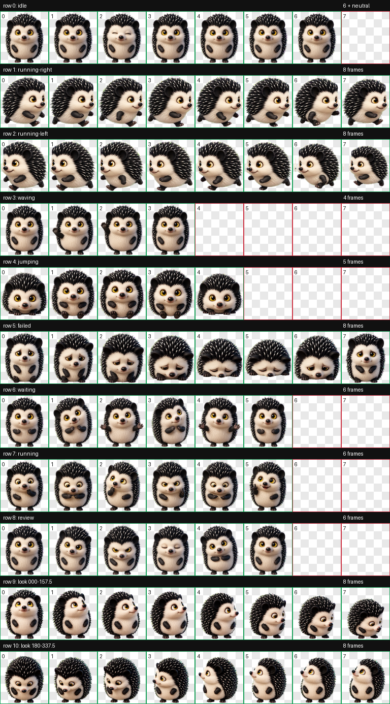

# Noir

Noir is a custom Codex pet: a sweet, quietly mischievous black-and-cream hedgehog with luminous golden eyes and tiny paws.



## Install

Copy the packaged pet into your Codex pets directory:

```sh
mkdir -p ~/.codex/pets/noir
cp noir/pet.json noir/spritesheet.webp ~/.codex/pets/noir/
```

Restart Codex if Noir does not appear immediately.

## Package

- Pet ID: `noir`
- Sprite format: Codex pet v2
- Atlas: `1536 × 2288` WebP, arranged as 8 columns × 11 rows
- Cell size: `192 × 208`

The package includes the standard animation states and 16 clockwise look directions.
